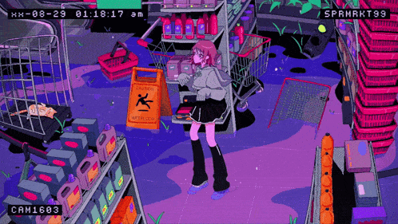

  <h1>Hello my name is Supavit Plubcheen this is my profile</h1>
  
I am 2nd year student from <a href="http://www.kosen.kmitl.ac.th/en">KOSEN KMITL</a>

  
interested in cyber security and application development

  <h1>languages and tools</h1>
  &nbsp;&nbsp;&nbsp;
  &nbsp;&nbsp;&nbsp;
  &nbsp;&nbsp;&nbsp;
  

  <h1>more about me</h1>
  
hobby : games, table tennis, learning algorithm, learning math

  
I also like to watch a lot of animes and listen to a lot of musics

  
  
   
  

